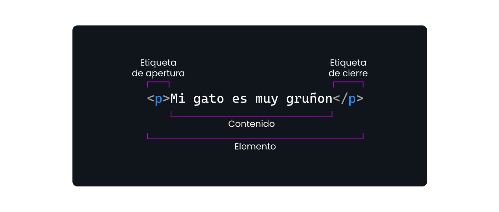

# Paso 2 - ¡A trabajar en equipo!#
## clase_01

## Actividad - Organizar el espacio de trabajo

Esta actividad está orientada a que puedan preparar su espacio de trabajo.  

En la programación es muy importante trabajar de manera organizada para que a medida que los proyectos se vayan desarrollando y aumenten en complejidad, puedan gestionarlos adecuadamente.

¿Cómo logro esto? Podrás ver el paso a paso en el siguiente video:
https://youtu.be/XUuNkJuzQ-U
Ahora vamos a generar la estructura de trabajo en tu computadora para poner ¡manos a la obra!

💠 Sigue estos pasos:

- Crea tus carpetas de trabajo tomando como referencia el video.

- Abre el Visual Studio Code. *Si aún no lo tienes instalado, revisa el paso anterior o pide ayuda a tus compañeros. 

- Vincula tus carpetas con tu espacio de trabajo dentro de Visual Studio Code.

## Asegúrate de:

Tener instalado Visual Studio Code

Tener organizado tu espacio de trabajo, con las carpetas creadas. 

💡 Estos pasos son muy importantes dado que ayudarán a que todos puedan tener la mejor experiencia posible y logren resolver los desafíos correspondientes.

#  👣 Paso 3 - ¡Primeros pasos con HTML!

Hasta acá preparamos el ambiente para que puedas comenzar a trabajar en el proyecto de este curso que es la creación de tu página personal. 

Es hora de sumergirnos en algunos ejercicios que te permitirán aprender los conceptos básicos de HTML y CSS para comenzar a construir el esqueleto de tu sitio web.

HTML (Hypertext Markup Language) es el lenguaje de marcado estándar usado para crear la estructura de un sitio web. 

CSS (Cascading Style Sheets) es un lenguaje que se utiliza para dar estilo a los HTML con elementos como colores, fuentes y espaciado para generar páginas web visualmente atractivas. 

En resumen, HTML se utiliza para establecer la estructura del sitio, mientras que CSS se utiliza para darle estilo. Es decir, que dos sitios con el mismo HTML (o sea, misma estructura), pueden lucir totalmente diferente debido al CSS. 

A continuación les dejamos el siguiente link CSS Zen Garden, en el cual se muestran diferentes estilos aplicados a una misma estructura de HTML. 

¡Vean cómo una misma estructura puede tomar diferentes estilos!

HTML vs CSS | Programación Web Desde Cero | Egg

Estructura HTML
En HTML existe estructura principal que se debe respetar cada vez que comenzamos a crear una web.  

Se estructura de la siguiente manera:

<!DOCTYPE html>: Esta es la declaración DOCTYPE para HTML5. Le dice al navegador que el documento es un documento HTML5.

<html lang="es">: El elemento raíz del documento. El atributo lang especifica el idioma del contenido del documento, en este caso, español (es).

<head>: Contiene metadatos y otros elementos que no se muestran directamente en la vista principal del navegador, como enlaces a hojas de estilo, scripts y otros.

<meta charset="UTF-8">: Define la codificación de caracteres utilizada en el documento. UTF-8 es la codificación más comúnmente utilizada.

<meta name="viewport" content="width=device-width, initial-scale=1.0">: Esencial para hacer que las páginas web sean responsivas. Ajusta el área visible del navegador al tamaño del dispositivo.

<title>: Define el título del documento, que se muestra en la pestaña del navegador o en la barra de título.

<body>: Contiene el contenido visible de la página web, como texto, imágenes, enlaces, formularios y más.

Elementos HTML
El lenguaje HTML se escribe mediante elementos. Los elementos tienen una estructura determinada, como se muestra en esta imagen. 

* Todo lo que se encuentra entre < > es una etiqueta

 * 

 es una etiqueta de párrafo, es decir que sirve para escribir un texto.

## Estilos en CSS
En el código CSS se aplican reglas de estilo que afectarán al HTML como se muestra en la siguiente imagen

* Siempre debemos indicar el elemento al cuál estaremos afectando con el estilo CSS, en este caso el h1 (que es un elemento de título en html)

* Luego aplicaremos las propiedades que deseemos, junto con sus valores correspondientes. En el ejemplo le estamos aplicando un color negro al título h1.

El elemento más común y utilizado en HTML es 

.  Este elemento representa un contenedor de bloque. Es una de las etiquetas más empleadas en el diseño y estructuración de páginas web.  La etiqueta 
 no tiene un significado semántico específico. Es decir, por sí misma, no indica qué tipo de contenido debe ir dentro de ella. Es simplemente un contenedor genérico.

Ahora sí, ¡Vamos a dar el primer paso codeando, qué emoción! 

 ¡Comencemos! 🚀
 

## Construyendo mi primer HTML
 Ahora bien, el primer paso y esqueleto de toda página web es crear un documento HTML. ¡Manos a la obra!

El objetivo de esta actividad es:

Crear un archivo llamado index.html y otro llamado styles.css dentro de la carpeta 📁mi_primera_web (creada en el paso anterior).

Dentro de index.html crear la estructura básica de HTML. Esto significa que debe incluir las etiquetas <!DOCTYPE html>, <html>, <head>, <body>, y <title>.

¿Cómo logro esto? Si tienes dudas, podrás ver el paso a paso en el siguiente video:

Aquí veremos cómo hacer la estructura básica:

https://youtu.be/89KsIUa2HCI

 Linkear el CSS
El objetivo de esta actividad es:

1. Vincular el archivo CSS al archivo HTML. 

2. Comprobar que esté correctamente vinculado, agregando un background-color:black; a todo el sitio 

¿Cómo logro esto? Si tienes dudas, podrás ver el paso a paso en el siguiente video:

Aquí veremos cómo asociar el archivo CSS a nuestro HTML.
https://youtu.be/GwV2YyrOODQ

## Elementos HTML y estilos CSS
El objetivo de esta actividad es practicar, mediante la creación de diferentes elementos HTML con sus estilos CSS. Para ello vamos a seguir los siguientes pasos:

Crea una nueva carpeta llamada📁 practica_1 a la misma altura que la carpeta 📁 mi_primera_web

Dentro de la carpeta practica_1, crea un archivo index.html y un archivo styles.css

Vincular el archivo styles.css al index.html

Dentro del archivo index.html y entre las etiquetas <body></body>, inserta los 6 tipos de encabezados (<h1>, <h2>, <h3>, <h4>, <h5> y <h6>). Coloca textos en cada uno y verifica cómo van quedando en tu web. 

Encierra los encabezados dentro de una etiqueta 

 que los agrupe y funcione como contenedor. Puedes probar colocando un color de fondo para entender cómo se comporta el contenedor 

Agrega un párrafo utilizando una etiqueta 
, que contenga una breve presentación personal y agrégale un background-color: blue; (pueden usar el color que prefieran)

Agrega una lista ordenada y una lista desordenada a tu página usando las etiquetas <ol> y <ul>, respectivamente. Dentro de cada una, crea al menos tres elementos utilizando la etiqueta <li>. 

Recuerda siempre guardar los cambios en el archivo y recarga la web en el explorador para ver los resultados.

📌 Importante: El valor de la propiedad color, puede ser un nombre de color, un código hexadecimal o un valor RGB. Pueden ver más información en 👉 Colores CSS (pueden traducir el sitio con el traductor de google)

¿Cómo logro esto? Si tienes dudas, podrás ver el paso a paso en el siguiente video:

Aquí veremos cómo crear diferentes elementos HTML y aplicar estilos CSS: 

Elementos HTML y CSS  |Programación Web Desde Cero | Egg

Hay ciertos puntos a tener en cuenta que esperamos que puedan aprender para las próximas clases, ya que iremos profundizando sobre los mismos. 

HTML tiene una estructura básica que debemos respetar para la creación de cualquier página web.  <!DOCTYPE html>, <html>, <head>, <body>.

El lenguaje HTML está compuesto por etiquetas. Dentro de las etiquetas <head></head> se escribe todo el contenido que no se va a ver en el navegador web, como por ejemplo el link al archivo CSS. Dentro de las etiquetas <body></body> se escribe todo el contenido que sí veremos en el navegador web. 

El lenguaje CSS está compuesto por reglas de estilo CSS, que lo que hacen es aplicar propiedades y valores a un elemento HTML, que llamamos selector. 

Elementos HTML que vimos hasta ahora: <h1> a <h6>, 
, <ul>, <ol>, <li>